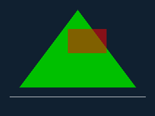

# qemu_custom_dev

QEMU 上の Linux ゲストに対し、独自仮想デバイス経由でホスト側機能
（簡易自作レンダラ）を接続するプロジェクト。デバイスドライバ開発と
ホスト・ゲスト間通信の仕組みの学習を兼ねる。

まず動かしてみたい場合は [使ってみる](#使ってみる) へ。設計の経緯と全体
計画は [docs/handoff-2026-07-24.md](docs/handoff-2026-07-24.md)、
プロトコル仕様は [docs/protocol.md](docs/protocol.md)、資料の一覧は
[ドキュメント](#ドキュメント) を参照。

## 方針

- QEMU 本体は改変しない（無改変で成立する方式を優先）。
- 実在ハードウェアの模倣はしない。
- プロトコル定義と輸送層を分離し、Phase ごとに輸送層だけを差し替える。
- 依存は最小限（ビルドは C11 ツールチェーンと GNU make のみ）。

## 段階的計画

| Phase | 輸送層 | ゲスト側 | 状態 |
|-------|--------|----------|------|
| 1 | vsock（`vhost-vsock-pci`） | 標準ソケット API | **完了** |
| 2 | ivshmem-plain 共有メモリ（[docs/shm-transport.md](docs/shm-transport.md)） | BAR2 を mmap するユーザ空間ドライバ、ポーリング | **完了** |
| 3 | ivshmem-doorbell（[docs/doorbell-transport.md](docs/doorbell-transport.md)） | 自作カーネルモジュール、MSI-X 割り込み駆動 | **完了** |
| 4 | vhost-user（[docs/vhost-user.md](docs/vhost-user.md)） | 自作 virtio ドライバ、virtqueue | **完了** |

Phase 2 と 3 はリングもメッセージも共通で、違いは通知方式（ポーリング /
割り込み）だけ。Phase 4 はその自作リングをやめ、virtio の vring と
vhost-user バックエンドに置き換える。`guest/user/bench.c` で 3 者を
実測比較できる（`tests/vm-e2e.sh` が実ゲストで自動計測する）。

どの Phase でも **QEMU 本体は無改変**で、プロトコル定義（`proto/`）も
共通。差し替えているのは輸送層だけ、というのがこの計画の主眼。

拡張:

- **v0.2 BLIT**: 共有メモリ上に置いたピクセルをホストが取り込むゼロコピー
  経路。コマンドはリングを通るがピクセルは通らない、という共有メモリ本来の
  使い方（共有メモリ輸送でのみ有効）。
- **v0.3 ラスタライザ**: 線・塗りつぶし三角形と、アルファ合成
  （source-over）。全輸送で使える。レンダラ本体の設計判断（出力先を
  ファイルにした理由、合成の丸め規則）は [docs/renderer.md](docs/renderer.md)。

## ドキュメント

はじめて読む場合は上から順に。

| ドキュメント | 内容 |
|--------------|------|
| [docs/handoff-2026-07-24.md](docs/handoff-2026-07-24.md) | 出発点となった設計方針と全体計画 |
| [docs/protocol.md](docs/protocol.md) | プロトコル仕様（v0.3）。全 Phase 共通 |
| [docs/renderer.md](docs/renderer.md) | レンダラ本体。描画コマンドと合成規則、出力先の決定理由 |
| [docs/guest-image.md](docs/guest-image.md) | ゲスト環境の作り方（Ubuntu cloud image + cloud-init） |
| [docs/shm-transport.md](docs/shm-transport.md) | Phase 2: 共有メモリのレイアウトとリング設計 |
| [docs/doorbell-transport.md](docs/doorbell-transport.md) | Phase 3: 割り込み駆動化とカーネルモジュール |
| [docs/vhost-user.md](docs/vhost-user.md) | Phase 4: virtio / vhost-user 化 |

各 Phase のドキュメントには「動かし方」節と「つまずきどころ」節がある。

## リポジトリ構成

```
proto/          プロトコル定義とコーデック（輸送層非依存）
host/           ホストデーモン renderd（vhost-user バックエンドを含む）と
                ivshmem サーバ ivshmemd
guest/user/     ゲスト側クライアントライブラリ、デモ、ベンチマーク
guest/kmod/     ゲストカーネルモジュール（Phase 3 / 4）と、そのユーザ空間 API
scripts/        QEMU 起動・ゲストイメージ生成・モジュールビルドの各スクリプト
containers/     コンテナ定義（開発環境一式 / モジュールビルド用）
tools/          補助ツール（PPM→PNG 変換器）
tests/          単体テストと E2E テスト
docs/           仕様・設計資料と、その中で使う実出力画像
.tmp/           gitignore 対象の作業ディレクトリ
```

## ビルドとテスト

```console
$ make          # build/ に renderd, ivshmemd, demo, bench, テスト類を生成
$ make test     # プロトコル単体テスト + QEMU 不要の E2E テスト
```

`make test` は QEMU なしで完結する（AF_UNIX・TCP・共有メモリ・doorbell の
4 輸送で同一プロトコルを検証。輸送層非依存の確認を兼ねる。BLIT の描画結果が
コマンド描画とバイト単位で一致することと、ストリーム輸送では拒否されることも
確認する）。

`tests/vm-e2e.sh` は実際にゲストを 3 回ブートし、ゲスト内からホストの
renderd への描画を無人で検証する（CI で毎 PR 実行）。カーネルモジュール
2 本の経路と、3 Phase のレイテンシ比較を含む。`/dev/vhost-vsock` がある
環境では vsock 輸送も検証する。

**描画結果は CI のアーティファクトとして落とせる**。各ジョブが出力
フレームを PNG に変換して `frames-host` / `frames-guest` という名前で
アップロードするので、Actions の run ページからそのまま見られる
（失敗した run でもアップロードされる。ゲスト側はコンソールログも
一緒に入るので、ブートがこけたときの調査に使える）。

## 使ってみる

### 1. QEMU なしで動かす（いちばん手軽）

ホストのプロセス間で同じプロトコルをそのまま流せる。ゲストもカーネル
モジュールも要らない。

```console
$ make
$ build/renderd --unix .tmp/r.sock --out .tmp/frames &
$ build/demo --unix .tmp/r.sock --rich
```

`.tmp/frames/frame-000001.ppm` に描画結果が出る。`--rich` は v0.3 の
線・三角形・アルファ合成を使うシーン:



`--rich` なしだと矩形 2 枚だけの基準シーンになる（全輸送のテストが
ピクセルを照合している方）。両方の画像と描画内容は
[docs/renderer.md](docs/renderer.md#期待される出力)。

PPM はブラウザで開けないので、見るときは `build/ppm2png` で PNG に
変換する（`scripts/frames-to-png.sh .tmp/frames` でまとめて変換）。

### 2. ゲストから動かす

ゲストを動かすには QEMU・ゲスト用カーネルヘッダ・ISO ツールが要る。
**ホストに入れたくない場合はコンテナを使う**（CI が使っているのと同じ
パッケージ構成。詳細は [containers/README.md](containers/README.md)）:

```console
$ scripts/dev-container.sh                   # 対話シェル
$ scripts/dev-container.sh make test         # ビルドしてテスト
$ scripts/dev-container.sh tests/vm-e2e.sh   # ゲストをブートして全 Phase
```

リポジトリだけをマウントし、呼び出したユーザ権限で動くので、ホスト側に
残るのは `build/` と `.tmp/` だけ。`/dev/kvm` があれば自動で渡す（無くても
TCG で動く、遅いだけ）。以降のコマンドはコンテナの中でも外でも同じ。

自分の環境に直接入れる場合に必要なパッケージは
`containers/dev.Dockerfile` にそのまま並んでいる。

まずゲストイメージを 1 度だけ作る。Ubuntu 24.04 cloud image を
SHA256 固定で取得し、cloud-init で自動構築する（詳細と決定事項は
[docs/guest-image.md](docs/guest-image.md)）。

```console
$ scripts/make-guest-image.sh
```

あとは Phase ごとに「ホストで起動するデーモン」「ゲストに渡す QEMU
オプション」「ゲスト内で叩くコマンド」の 3 点が変わるだけ。

| Phase | ホスト | QEMU | ゲスト内 | 手順の詳細 |
|-------|--------|------|----------|------------|
| 1 vsock | `renderd --vsock 5000` | （既定で付く） | `demo --vsock 2 5000` | 下記 |
| 2 共有メモリ | `renderd --shm .tmp/shm.bin` | `IVSHMEM=.tmp/shm.bin` | `sudo demo --shm-pci` | [shm-transport.md](docs/shm-transport.md#動かし方) |
| 3 doorbell | `ivshmemd` + `renderd --ivshmem` | `IVSHMEM_SOCKET=` | `insmod ivshmem_rproto.ko` → `sudo demo --doorbell` | [doorbell-transport.md](docs/doorbell-transport.md#動かし方) |
| 4 vhost-user | `renderd --vhost-user .tmp/vu.sock` | `VHOST_USER=.tmp/vu.sock` | `insmod virtio_rproto.ko` → `sudo demo --virtio` | [vhost-user.md](docs/vhost-user.md#動かし方) |

Phase 3 と 4 はカーネルモジュールが要る。`scripts/build-kmod.sh` が
ゲストカーネル（6.8.0-134-generic 固定）向けにビルドする
（docker があればコンテナ内、無ければ `--direct` で導入済みヘッダを使う）。

Phase 1 を例に、全体の流れ:

1. ホストで vhost-vsock を有効化し、デーモンを起動:

   ```console
   $ sudo modprobe vhost_vsock
   $ build/renderd --vsock 5000 --out .tmp/frames
   ```

2. ゲストを起動（リポジトリは 9p で `/mnt/repo` に read-only 共有される）:

   ```console
   $ IMG=.tmp/guest/disk.qcow2 SEED=.tmp/guest/seed.iso scripts/run-qemu.sh
   ```

3. ゲスト内（シリアルコンソール、`dev`/`dev`）でビルドし、ホスト
   （CID 2）へ接続:

   ```console
   guest$ cp -r /mnt/repo ~/work && cd ~/work && make
   guest$ ./build/demo --vsock 2 5000
   ```

4. ホストの `.tmp/frames/frame-000001.ppm` に描画結果が出力される。

`scripts/run-qemu.sh` が受け取る環境変数（`IVSHMEM`、`IVSHMEM_SOCKET`、
`VHOST_USER` など）は同スクリプト冒頭のコメントに一覧がある。

### 3. 全部まとめて確認する

```console
$ tests/vm-e2e.sh
```

ゲストを 3 回ブートし、上の Phase 1〜4 を無人で一通り実行して、出力
フレームのピクセルまで検証する。ホスト側の準備（デーモン起動、モジュール
ビルド、イメージ生成）も全部この中でやるので、まず動くところを見たい
場合はこれが早い。ホストを汚したくなければ
`scripts/dev-container.sh tests/vm-e2e.sh`。

### 4. 自分のクライアントから使う

`guest/user/render_client.h` が輸送層を隠したクライアント API。
`rc_connect_argv()` にコマンドライン引数をそのまま渡せば、
`--unix` / `--vsock` / `--tcp` / `--shm-file` / `--shm-pci` /
`--doorbell` / `--virtio` のどれで接続するかを選べる。実際の使用例は
`guest/user/demo.c`（60 行程度）を参照。

## 開発ルール

- コミットは [Conventional Commits](https://www.conventionalcommits.org/) に従う。
- `main` への merge は PR 経由で行う。
- 一時ファイルはリポジトリ内の `.tmp/`（gitignore 済み）に置く。
- 新規ファイルには SPDX ライセンス識別子を付ける（下記）。

## ライセンス

本プロジェクトは **GNU General Public License v2.0 only（GPL-2.0-only）** で
配布する。全文は [LICENSE](LICENSE) を参照。

GPL を選んでいる理由: `guest/kmod/` のゲストカーネルモジュール
（`ivshmem_rproto`、`virtio_rproto`）は Linux カーネルモジュールであり、カーネルの内部 API を
使うため GPL-2.0 でなければならない（ソースは
`// SPDX-License-Identifier: GPL-2.0-only`、モジュールは
`MODULE_LICENSE("GPL")` を宣言している。これがないとカーネルは
GPL 限定シンボルの使用を拒否する）。リポジトリ内の他のコンポーネント
（ホストデーモン、ゲストユーザ空間、プロトコル層、テスト）はカーネル
モジュールと同じ ABI ヘッダ（`guest/kmod/*_rproto.h`）を共有しており、
ライセンスを揃えておくのが素直なため、プロジェクト全体を同一の
GPL-2.0-only とする。

リポジトリ内の全ソースファイル（C、シェルスクリプト、Makefile、
Dockerfile、CI 定義）は先頭に `SPDX-License-Identifier: GPL-2.0-only` を
持つ。

外部由来のもの: ゲスト実行環境として使う Ubuntu cloud image と QEMU は
本リポジトリには含まれず、実行時に各自のライセンスで入手・利用される
（QEMU 本体は無改変）。
