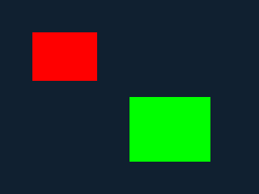

# レンダラ本体（決定事項と実装）

引き継ぎ資料 §8 の未決定事項「レンダラ本体の仕様（描画方式、出力先）」を
決定し、実装したもの。プロトコル側の定義は [protocol.md](protocol.md)、
実装は `host/renderd.c`。

## 決定事項

| 項目 | 決定 | 理由 |
|------|------|------|
| 描画方式 | ホスト側の CPU ソフトウェアラスタライザ | GPU も外部ライブラリも要らず、結果が完全に決定的でピクセル単位のテストが書ける。学習目的にも合う |
| 内部フォーマット | RGBA8888（u32 に `0xRRGGBBAA`） | プロトコルの色表現と一致し、変換が入らない |
| **出力先** | **ファイル出力（PPM / P6）** | 下記 |
| 合成 | 既定は上書き、`SET_BLEND` で source-over に切り替え | v0.1/v0.2 の挙動を変えずに透明度を使えるようにする |

### 出力先をウィンドウ表示にしなかった理由

ウィンドウ表示（SDL / X11 等）は、

- **依存を増やす**。「依存パッケージは最小限」という本プロジェクトの方針に
  反する。現状ビルドに必要なのは C11 ツールチェーンと GNU make だけ。
- **ヘッドレスで検証できない**。CI にもこの開発環境にもディスプレイがなく、
  「実際に描けているか」を自動で確かめる手段がなくなる。現在は出力 PPM の
  ピクセルを直接検証しており、これが全テストの土台になっている。

PPM (P6) は追加ライブラリなしで書けて、一般的なビューアや ImageMagick が
そのまま開ける。表示が必要なら `display frame-000001.ppm` などで見れば
よく、レンダラ本体に GUI を持ち込む必要はない。

ブラウザや GitHub は PPM を表示しないので、**見せる**用途にだけ
`tools/ppm2png` で PNG に変換する（下の「期待される出力」、CI が
アップロードするアーティファクト）。この変換器も zlib を使わず自前で
DEFLATE を書いており、依存は増えていない。テストが照合するのは
変換前の PPM のまま。

将来ウィンドウ表示を足す場合も、**別プロセスが出力ディレクトリを監視して
表示する**形にすればレンダラ本体の依存は増えない。

## 描画コマンド

| コマンド | 版 | 内容 |
|----------|-----|------|
| `CLEAR` | v0.1 | サーフェス全体を単色で埋める。**合成モードに関わらず上書き**（クリア対象に合成する意味がないため） |
| `FILL_RECT` | v0.1 | 矩形塗り。サーフェス境界でクリップ |
| `BLIT` | v0.2 | 共有メモリ上のピクセルを取り込む。ソースのピクセルごとにアルファを持つ |
| `DRAW_LINE` | v0.3 | Bresenham。端点は符号付きで、サーフェス外に出た画素は捨てる |
| `DRAW_TRIANGLE` | v0.3 | 塗りつぶし三角形。エッジ関数によるラスタライズ |
| `SET_BLEND` | v0.3 | 以降の描画に使う合成モードを切り替える |

### 三角形のラスタライズ

3 頂点のバウンディングボックスをサーフェスでクリップし、その範囲の各画素に
ついて 3 本のエッジ関数（外積 = 符号付き面積の 2 倍）を評価する。すべて
同符号なら内側。**巻き方向（CW/CCW）はどちらでもよい**: 三角形全体の符号付き
面積の符号を取り出して基準にするため。面積 0（退化三角形）は何も描かない。

座標は 64bit で計算するので、符号付き 32bit の頂点をどれだけ遠くに置いても
オーバーフローしない。

### 線のラスタライズ

Bresenham。事前にクリップせず、画素を打つ時点で範囲外を捨てる。端点が
サーフェスからはるか外にあってもよく、ループは十分安価。

## 合成（source-over）

`SET_BLEND(SRC_OVER)` 以降、各チャンネルは次式で合成される（整数演算、
四捨五入）:

```
out = (src * a + dst * (255 - a) + 127) / 255      a = ソースのアルファ
```

出力アルファは同じ式でソースを不透明扱いにしたもの:

```
out_a = (255 * a + dst_a * (255 - a) + 127) / 255
```

この形にしているのは、`a + dst_a*(255-a)/255` を素直に足し算で書くと
255 を超えうるため（実装当初これで青チャンネルへ桁上がりするバグを出した。
上式なら構造的に 255 以下になる）。

**すべて整数で、丸めも固定**なので結果は完全に再現可能で、テストは
期待値を手計算で書き下している（`tests/e2e.sh` の rasterizer レグ）。
アルファ 0 と 255 は早期に分岐して計算を飛ばす。

例: 背景 `0x102030` に 50% 赤（`0xff000080`、a=128）を重ねると

| ch | 計算 | 結果 |
|----|------|------|
| R | (255·128 + 16·127 + 127) / 255 | 136 (0x88) |
| G | (0 + 32·127 + 127) / 255 | 16 (0x10) |
| B | (0 + 48·127 + 127) / 255 | 24 (0x18) |

→ `0x881018`。

## 動かす

```console
$ build/renderd --unix .tmp/r.sock --out .tmp/frames &
$ build/demo --unix .tmp/r.sock --rich
```

`.tmp/frames/frame-000001.ppm` に、三角形・線・半透明矩形を含む
320x240 のフレームが出力される。`--rich` を付けないと v0.1 の
矩形だけのシーンになる（こちらは全輸送のテストで使う基準シーン）。

## 期待される出力

| `demo`（既定 = 基準シーン） | `demo --rich`（v0.3） |
|---|---|
|  |  |

左が全輸送のテストが照合している基準シーン。背景 `0x102030`、赤と緑の
矩形 2 枚だけで、`ppm_check` が (5,5)=`102030`、(60,60)=`ff0000`、
(200,150)=`00ff00` を確認している。BLIT 経路（v0.2）が出すフレームも
**これとバイト単位で同一**でなければならない（`tests/e2e.sh` と
`tests/vm-e2e.sh` が `cmp` で確認している）ので、別画像は載せていない。

右が v0.3 の追加機能。緑の塗りつぶし三角形、白い線、そして赤の
半透明矩形（アルファ 50%）を source-over で重ねたもの。三角形の上では
オリーブ色、背景の上では暗い赤になり、**同じ矩形が下地によって違う色に
なる**ことがアルファ合成が効いている証拠になる。この画像の重なり部分の
画素値が、上の表で手計算した `0x881018` 系の値と一致する。

この 2 枚は装飾ではなくレンダラの実出力で、`scripts/make-doc-images.sh`
が実際に `renderd` と `demo` を走らせて生成している。`--check` を付けると
コミット済みの画像と生成結果を突き合わせ、ずれていれば失敗する（CI で
毎回実行）。つまり**レンダラの出力が変わればこのドキュメントの画像も
必ず更新される**。

なお表示用に PNG を使っているが、レンダラ自身の出力は PPM のままで、
変換は `tools/ppm2png.c`（zlib を使わない自前の PNG ライタ）が行う。
出力先を PPM にした理由は上の「決定事項」を参照。

## 制約

- サーフェスはセッションあたり 1 枚、RGBA8888 固定。
- アンチエイリアスなし（判定は画素中心）。決定性を優先している。
- 合成モードはセッション状態で、`CREATE_SURFACE` では変わらない。
